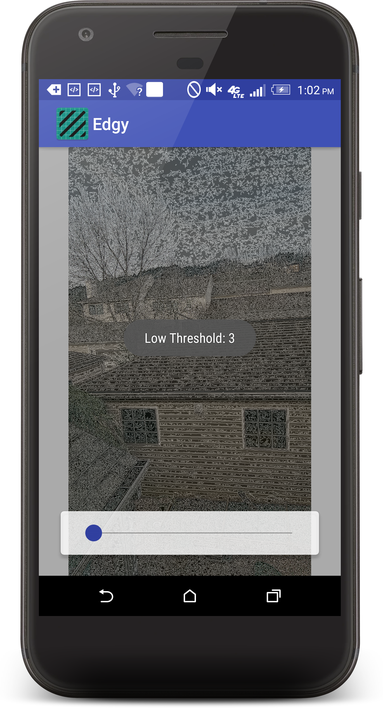
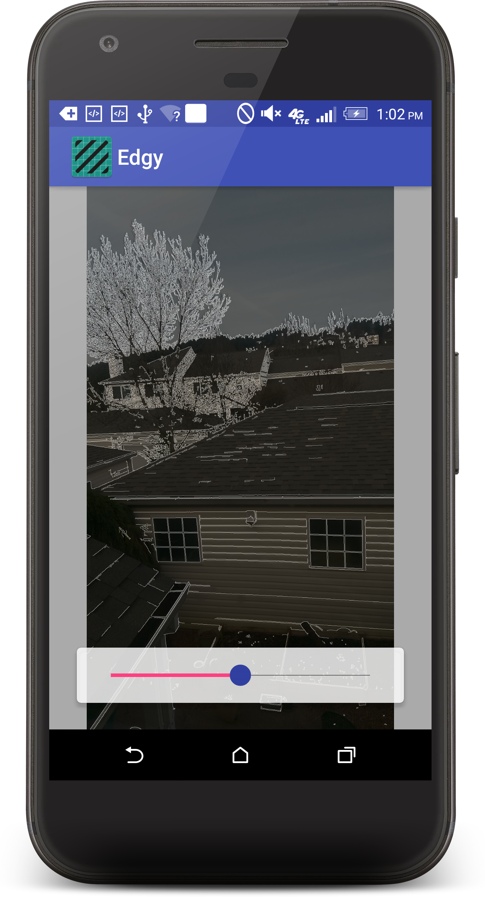
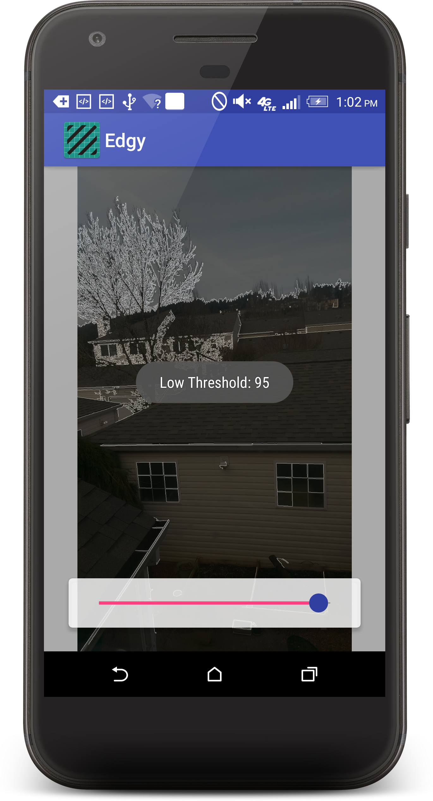

## Overview

Improved version of image_proc_ndk. Edge detection and Camera Image are refreshed at the same frame rate
for better user experience. Now uses NDK v20 and OpenCV v411.

## Screenshots

<p float="left">
  
   
  
</p>

## Motivation

OpenCV is a complete vision library offering tools to perform a variety of useful image processing needs.
This project was created to explore the use of the OpenCV libraries with Android, and specifically how to
use the library in such a manner as to not require the Opencv Manager app. This project is a refactored 
version of an earlier project completely re-written in Kotlin.

Note: This sample uses the older Android Camera API which is deprecated for devices running Lollipop or 
greater, and will be updated to also use the current Camera2 API. Controlling camera capture parameters
in response to image processing requirements gives the Camera2 API a clear edge over the older API.

## Installation

There are numerous examples outlining the usage of OpenCV with Android Studio. I have used the more recent
method of using a CMake file to build the native code. Here are a few samples:
https://developer.android.com/studio/projects/add-native-code.html
https://github.com/jlhonora/opencv-android-sample
https://stackoverflow.com/questions/38958876/can-opencv-for-android-leverage-the-standard-c-support-to-get-native-build-sup

## Code Snippets

Frame Ready from Camera:
```Kotlin
// make sure we have the right image format for OpenCV processing
override fun onPreviewFrame(data: ByteArray, camera: Camera) {
    if (mCamera?.parameters?.previewFormat == ImageFormat.NV21) {
        if (!mIsProcessing) {
            imageProcessJob = GlobalScope.launch(Dispatchers.Main) { doImageProcessing(data) }
        }
    } else {
        Log.e(TAG, "Wrong video format for OpenCV library")
    }
}
```

JNI call to OenCV:
```Kotlin
 // runnable for performing the Canny Edge Detection
private fun doImageProcessing(data: ByteArray) {

// set 'processing flag' true
mIsProcessing = true

// the c++ code will populate this
val outputArray = IntArray(mPreviewSizeWidth * mPreviewSizeHeight)

try {
    ImageProcessing(
            mPreviewSizeWidth,
            mPreviewSizeHeight,
            mThresholdValue,
            data,           // IN - byte array from camera
            outputArray)    // OUT - char array from c++ code
    } catch (e: Exception) {
    e.printStackTrace()
    }

    val mTransformBitmap = Bitmap.createBitmap(mPreviewSizeWidth, mPreviewSizeHeight, Bitmap.Config.ARGB_8888)

    // load bitmap into image view, add some transparency so we can see the camera's preview and
    // rotate. A nicer method would be to return the canny image (mImagePixels) without black background
    mTransformBitmap?.setPixels(outputArray, 0, mPreviewSizeWidth, 0, 0, mPreviewSizeWidth, mPreviewSizeHeight)
    cameraPreviewImageView.alpha = .60f
    cameraPreviewImageView.setImageBitmap(rotateBitmap(mTransformBitmap, 90f))

    // done processing
    mIsProcessing = false
}
```

OpenCV Edge detection:
```C++
#include <jni.h>
#include <opencv2/core/core.hpp>
#include <opencv2/imgproc/imgproc.hpp>
#include "ImageProcessing.h"

using namespace std;
using namespace cv;

extern "C"
bool
Java_com_software_corvidae_edgy_MainActivity_ImageProcessing (
        JNIEnv* env,
        const jobject thiz,
        const jint width,
        const jint height,
        const int lowThreshold,
        const jbyteArray NV21FrameData,
        jintArray outPixels) {

    int ratio = 3;

    /// Original image and grayscale copy
    jbyte* pNV21FrameData = env->GetByteArrayElements(NV21FrameData, 0);
    Mat gray_image(height, width, CV_8UC1, (unsigned char *)pNV21FrameData);

    /// Final Result image
    jint* poutPixels = env->GetIntArrayElements(outPixels, 0);
    Mat finalImage(height, width, CV_8UC4, (unsigned char *)poutPixels);

    /// Reduce noise with a 3x3 kernel
    Mat blurred;
    GaussianBlur(gray_image, blurred, Size(3, 3), 0);

    /// create new cv::Mat, canny it and convert
    Mat cannyMat(height, width, CV_8UC1);
    Canny(blurred, cannyMat, lowThreshold, lowThreshold * ratio, 3);
    cvtColor(cannyMat, finalImage, CV_GRAY2BGRA);

    /// cleanup
    env->ReleaseByteArrayElements(NV21FrameData, pNV21FrameData, 0);
    env->ReleaseIntArrayElements(outPixels, poutPixels, 0);

    return true;
}
```

CMake file:

```CMake

cmake_minimum_required(VERSION 3.6)

set(pathToProject /media/bobcat/DATA/Software_Projects/Edgy)
set(OpenCV_DIR /opt/OpenCV-android-sdk/sdk/native/jni/)
set(CMAKE_CXX_FLAGS "${CMAKE_CXX_FLAGS} -std=gnu++11")

find_package(OpenCV REQUIRED)
message(STATUS "$$$ opencv found: ${OpenCV_LIBS}")
include_directories(${CMAKE_CURRENT_SOURCE_DIR} ${OpenCV_DIR}/include/)

# Creates and names a library, sets it as either STATIC
# or SHARED, and provides the relative paths to its source code.
# You can define multiple libraries, and CMake builds it for you.
# Gradle automatically packages shared libraries with your APK.
add_library(
        # Sets the name of the library.
        ImageProcessing

        # Sets the library as a shared library.
        SHARED

        # Provides a relative path to your source file(s).
        # Associated headers in the same location as their source
        # file are automatically included.
        ImageProcessing.cpp)

add_library( lib_opencv SHARED IMPORTED )
set_target_properties(lib_opencv PROPERTIES IMPORTED_LOCATION ${pathToProject}/app/src/main/jniLibs/${ANDROID_ABI}/libopencv_java4.so)

# Specifies libraries CMake should link to your target library. You
# can link multiple libraries, such as libraries you define in the
# build script, prebuilt third-party libraries, or system libraries.
target_link_libraries(
        # Specifies the target library
        ImageProcessing

        # OpenCV lib
        lib_opencv

        android)
```
## License

Licensed under the Apache License, Version 2.0 (the &quot;License&quot;);
you may not use this file except in compliance with the License.
You may obtain a copy of the License at
http://www.apache.org/licenses/LICENSE-2.0
Unless required by applicable law or agreed to in writing, software
distributed under the License is distributed on an &quot;AS IS&quot; BASIS,
WITHOUT WARRANTIES OR CONDITIONS OF ANY KIND, either
express or implied.
See the License for the specific language governing
permissions and limitations under the License.